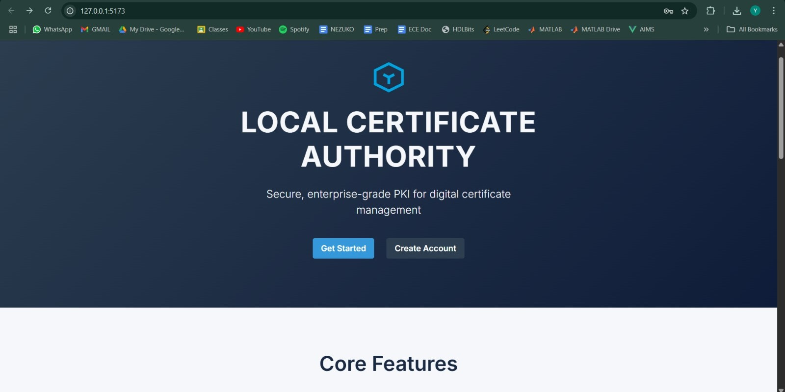
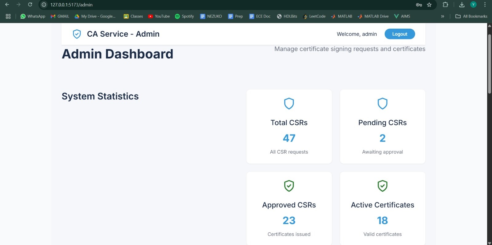
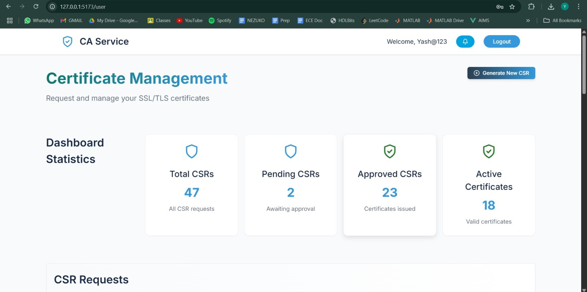

# Local Certificate Authority Service


The **Local Certificate Authority Service** is an open-source web application for managing Certificate Signing Requests (CSRs) and issuing X.509 certificates in an enterprise Public Key Infrastructure (PKI). It provides a user-friendly interface for submitting CSRs, admin workflows for approving/rejecting CSRs, and certificate issuance, with email notifications for key actions. This project partially implements a Certificate Authority (CA) and Registration Authority (RA) as outlined in a broader CA service specification.

**Note**: This project was developed as a prototype and does not include advanced features like OCSP, CRL, multi-PKI support, or HSM integration due to time constraints. It is suitable for educational purposes or small-scale PKI deployments.

## Features

- **User Dashboard**:
  - Register and verify email with OTP.
  - Generate and submit CSRs with customizable attributes (domain, company, etc.).
  - View and download CSRs and issued certificates.
  - Check dashboard stats (total CSRs, pending, approved, active certificates).
- **Admin Dashboard**:
  - View all/pending CSRs.
  - Approve or reject CSRs with email notifications.
  - View admin stats (total CSRs, pending, approved, active certificates).
- **Certificate Management**:
  - Generate CSRs using OpenSSL.
  - Issue X.509 v3 certificates signed by a CA.
  - Store certificates and track revocation (basic).
- **Security**:
  - JWT-based authentication.
  - Role-based access (admin vs. client).
  - Email notifications for signup, password reset, and CSR approval/rejection.
- **Tech Stack**:
  - **Backend**: Node.js, Express, PostgreSQL, `node-forge`, `nodemailer`, `openssl-nodejs`.
  - **Frontend**: React, Material-UI, Axios, Formik, Yup.
  - **Database**: PostgreSQL (`ca_db`).

## Prerequisites

Before setting up the project, ensure you have:

- **Node.js** (>= 18.x): [Download](https://nodejs.org/)
- **PostgreSQL** (>= 14.x): [Download](https://www.postgresql.org/download/)
- **OpenSSL** (>= 3.x): [Download](https://www.openssl.org/) or install via package manager:
  - Ubuntu: `sudo apt-get install openssl`
  - macOS: `brew install openssl`
  - Windows: Install via [OpenSSL for Windows](https://slproweb.com/products/Win32OpenSSL.html)
- **Gmail Account**: For SMTP email service (or another SMTP provider).
- **Git**: To clone the repository.

## Installation

### 1. Clone the Repository

```bash
git clone https://github.com/imabhi7/Local-Certificate-Authority-Service.git
cd Local-Certificate-Authority-Service
```

### 2. Set Up the Backend

1. **Navigate to the backend directory**:
   ```bash
   cd backend
   ```

2. **Install dependencies**:
   ```bash
   npm install
   ```

3. **Create a `.env` file**:
   - Copy `backend/.env.example` to `backend/.env`:
     ```bash
     cp .env.example .env
     ```
   - Edit `.env` with your values:
     ```
     PORT=5000
     DB_HOST=localhost
     DB_USER=postgres
     DB_PASSWORD=your_postgres_password
     DB_NAME=ca_db
     DB_PORT=5432
     JWT_SECRET=your_secure_jwt_secret
     EMAIL_USER=your_email@gmail.com
     EMAIL_PASSWORD=your_gmail_app_password
     CA_CERT_PATH=certs/ca-cert.pem
     CA_KEY_PATH=certs/ca-key.pem
     ```
     - **Generate a Gmail app-specific password**:
       - Go to [Google Account Settings](https://myaccount.google.com/security).
       - Enable 2-Step Verification.
       - Under "Signing in to Google," select "App passwords."
       - Generate a password for "Mail" and use it as `EMAIL_PASSWORD`.
     - **JWT_SECRET**: Use a random, secure string (e.g., `openssl rand -hex 32`).

4. **Generate CA Certificate and Key**:
   - Create a `certs` directory:
     ```bash
     mkdir certs
     ```
   - Generate a CA private key and certificate:
     ```bash
     openssl genrsa -out certs/ca-key.pem 2048
     openssl req -x509 -new -nodes -key certs/ca-key.pem -sha256 -days 3650 -out certs/ca-cert.pem -subj "/C=IN/ST=Punjab/L=Rupnagar/O=CA Service/OU=IT/CN=Local CA/emailAddress=ca@example.com"
     ```
   - Ensure `CA_CERT_PATH` and `CA_KEY_PATH` in `.env` point to `certs/ca-cert.pem` and `certs/ca-key.pem`.

### 3. Set Up the Database

1. **Install and start PostgreSQL**:
   - Follow your OS-specific instructions to install PostgreSQL.
   - Start the PostgreSQL service:
     - Ubuntu: `sudo service postgresql start`
     - macOS: `brew services start postgresql`
     - Windows: Use the PostgreSQL service manager.

2. **Create the database**:
   ```bash
   psql -U postgres -c "CREATE DATABASE ca_db;"
   ```

3. **Set up the schema**:
   - Save the following SQL to `backend/db_schema.sql`:
     ```sql
     -- Create users table
     CREATE TABLE IF NOT EXISTS public.users (
         id integer NOT NULL DEFAULT nextval('users_id_seq'::regclass),
         username character varying(255) NOT NULL,
         email character varying(255) NOT NULL,
         password character varying(255) NOT NULL,
         role character varying(50) DEFAULT 'client'::character varying,
         is_verified boolean DEFAULT false,
         otp character varying(6),
         otp_expiry timestamp without time zone,
         created_at timestamp without time zone DEFAULT CURRENT_TIMESTAMP,
         updated_at timestamp without time zone DEFAULT CURRENT_TIMESTAMP,
         CONSTRAINT users_pkey PRIMARY KEY (id),
         CONSTRAINT users_email_key UNIQUE (email),
         CONSTRAINT users_username_key UNIQUE (username)
     );

     CREATE INDEX IF NOT EXISTS idx_users_email ON public.users USING btree (email);

     -- Create csr_requests table
     CREATE TABLE IF NOT EXISTS public.csr_requests (
         id integer NOT NULL DEFAULT nextval('csr_requests_id_seq'::regclass),
         user_id integer NOT NULL,
         domain character varying(255) NOT NULL,
         company character varying(255) NOT NULL,
         division character varying(255) NOT NULL,
         city character varying(100) NOT NULL,
         state character varying(100) NOT NULL,
         country character varying(10) NOT NULL,
         email character varying(255) NOT NULL,
         root_length integer NOT NULL,
         csr text NOT NULL,
         created_at timestamp without time zone DEFAULT CURRENT_TIMESTAMP,
         status character varying(20) DEFAULT 'pending'::character varying,
         rejection_reason text,
         CONSTRAINT csr_requests_pkey PRIMARY KEY (id),
         CONSTRAINT csr_requests_user_id_fkey FOREIGN KEY (user_id)
             REFERENCES public.users (id) ON DELETE CASCADE
     );

     -- Create issued_certificates table
     CREATE TABLE IF NOT EXISTS public.issued_certificates (
         id integer NOT NULL DEFAULT nextval('issued_certificates_id_seq'::regclass),
         user_id integer,
         csr_id integer,
         domain character varying(255) NOT NULL,
         certificate text NOT NULL,
         issued_at timestamp without time zone DEFAULT CURRENT_TIMESTAMP,
         valid_till timestamp without time zone,
         status character varying(20) DEFAULT 'active'::character varying,
         CONSTRAINT issued_certificates_pkey PRIMARY KEY (id),
         CONSTRAINT issued_certificates_csr_id_fkey FOREIGN KEY (csr_id)
             REFERENCES public.csr_requests (id) ON DELETE CASCADE,
         CONSTRAINT issued_certificates_user_id_fkey FOREIGN KEY (user_id)
             REFERENCES public.users (id) ON DELETE CASCADE
     );

     -- Create revoked_certificates table
     CREATE TABLE IF NOT EXISTS public.revoked_certificates (
         id integer NOT NULL DEFAULT nextval('revoked_certificates_id_seq'::regclass),
         certificate_id integer NOT NULL,
         revoked_at timestamp without time zone DEFAULT CURRENT_TIMESTAMP,
         reason text,
         CONSTRAINT revoked_certificates_pkey PRIMARY KEY (id),
         CONSTRAINT revoked_certificates_certificate_id_fkey FOREIGN KEY (certificate_id)
             REFERENCES public.issued_certificates (id) ON DELETE CASCADE
     );
     ```
   - Run the schema:
     ```bash
     psql -U postgres -d ca_db -f backend/db_schema.sql
     ```

4. **Create sequences** (if not created automatically):
   ```sql
   CREATE SEQUENCE IF NOT EXISTS users_id_seq;
   CREATE SEQUENCE IF NOT EXISTS csr_requests_id_seq;
   CREATE SEQUENCE IF NOT EXISTS issued_certificates_id_seq;
   CREATE SEQUENCE IF NOT EXISTS revoked_certificates_id_seq;
   ```

5. **Set up admin and user accounts**:
   - The backend automatically creates an admin account on startup (`index.js`):
     - Username: `admin`
     - Email: `caservice2025@gmail.com`
     - Password: `admin@123`
     - Role: `admin`
     - Verified: `true`
   - **Change the admin password** after setup:
     ```sql
     UPDATE users SET password = crypt('new_admin_password', gen_salt('bf')) WHERE username = 'admin';
     ```
     (Requires `bcrypt` extension in PostgreSQL; if not installed, create manually or update via frontend.)
   - Create a test user manually:
     ```sql
     INSERT INTO users (username, email, password, role, is_verified)
     VALUES ('user1', 'user1@example.com', crypt('user@123', gen_salt('bf')), 'client', true);
     ```

### 4. Set Up the Frontend

1. **Navigate to the frontend directory**:
   ```bash
   cd frontend
   ```

2. **Install dependencies**:
   ```bash
   npm install
   ```

3. **Run the development server**:
   ```bash
   npm run dev
   ```
   - Access at `http://localhost:5173` (default Vite port).

4. **Build for production** (optional):
   ```bash
   npm run build
   ```

### 5. Configure Email Service

- The backend uses Gmail SMTP via `nodemailer` (`emailService.js`, `certificateController.js`).
- Ensure `EMAIL_USER` and `EMAIL_PASSWORD` in `.env` are set correctly.
- Test email sending:
  ```bash
  node -e "require('nodemailer').createTransport({service: 'gmail', auth: {user: process.env.EMAIL_USER, pass: process.env.EMAIL_PASSWORD}}).sendMail({from: process.env.EMAIL_USER, to: 'test@example.com', subject: 'Test', text: 'Test email'}, (err) => console.log(err || 'Email sent'))"
  ```
- **Alternative SMTP**: Update `transporter` in `emailService.js` and `certificateController.js` for other providers (e.g., SendGrid).

### 6. Configure OpenSSL

- OpenSSL is used for CSR generation (`opensslService.js`, `certificateController.js`).
- Ensure OpenSSL is installed and accessible in your PATH:
  ```bash
  openssl version
  ```
- The backend generates CSRs via `child_process.exec` in `certificateController.js`. No additional setup is needed beyond installing OpenSSL.

### 7. Start the Application

1. **Start the backend**:
   ```bash
   cd backend
   node index.js
   ```
   - Confirm: `✅ Server running on port 5000`.

2. **Start the frontend** (in another terminal):
   ```bash
   cd frontend
   npm run dev
   ```

3. **Access the application**:
   - User Dashboard: `http://localhost:5173`
   - Admin Dashboard: `http://localhost:5173/admin`

## Demo

To demonstrate the Local Certificate Authority Service:

1. **Register a User**:
   - Go to `http://localhost:5173/signup`.
   - Enter:
     - Username: `user1`
     - Email: `user1@example.com`
     - Password: `user@123`
   - Receive an OTP email, verify, and log in.

2. **Submit a CSR**:
   - Log in as `user1` at `http://localhost:5173`.
   - Navigate to "Generate CSR" or "Submit CSR".
   - Enter:
     - Domain: `test.example.com`
     - Company: `Test Inc`
     - Division: `IT`
     - City: `Rupnagar`
     - State: `Punjab`
     - Country: `IN`
     - Email: `user1@example.com`
     - Root Length: `2048`
   - Submit and confirm the CSR appears in the user dashboard.

3. **Approve/Reject CSR**:
   - Log in as admin at `http://localhost:5173/admin` (username: `admin`, password: `admin@123`).
   - Go to "Pending CSRs".
   - Approve or reject the CSR:
     - Approve: Generates a certificate, stored in `backend/certificates/cert_<id>.pem`.
     - Reject: Enter a reason (e.g., "Invalid domain").
   - Check email (`user1@example.com`) for approval/rejection notification.

4. **Download Certificate**:
   - Log in as `user1`.
   - Go to "Issued Certificates".
   - Download the certificate (`test.example.com_cert.pem`).

5. **View Stats**:
   - User Dashboard: Check total CSRs, pending, approved, and active certificates.
   - Admin Dashboard: View system-wide stats.

## Screenshots

Below are screenshots of the main interfaces of the Local Certificate Authority Service web application:

| Home Page | Admin Dashboard | User Dashboard |
|-----------|-----------------|----------------|
|  |  |  |

## Troubleshooting

- **Backend Errors**:
  - Check logs: `tail -f backend/index.js`.
  - Verify `.env` values and database connection:
    ```bash
    psql -U postgres -d ca_db -c "SELECT 1;"
    ```
- **Email Issues**:
  - Test SMTP as shown in "Configure Email Service."
  - Ensure Gmail allows less secure apps or use an app-specific password.
- **CSR Generation Fails**:
  - Verify OpenSSL installation: `openssl version`.
  - Check `backend/csr_files/` permissions.
- **404 on CSR Rejection**:
  - Ensure the CSR is still `pending`:
    ```sql
    SELECT id, status FROM csr_requests WHERE id = <id>;
    ```
  - Refresh the admin portal’s pending CSRs table.

## Contributing

We welcome contributions! To contribute:

1. Fork the repository.
2. Create a feature branch: `git checkout -b feature/your-feature`.
3. Commit changes: `git commit -m "Add your feature"`.
4. Push to the branch: `git push origin feature/your-feature`.
5. Open a pull request from your branch to the main branch of this repository.

Please follow the [Code of Conduct](CODE_OF_CONDUCT.md) and include tests for new features.

## License

This project is licensed under the [MIT License](LICENSE).

## Acknowledgments

- Developed under the guidance of **Dr. Balwinder Sodhi**.
- Inspired by enterprise PKI requirements for secure certificate management.

## Contact

For issues or questions, open a GitHub issue or contact the maintainers at [caservice2025@gmail.com](mailto:caservice2025@gmail.com).
